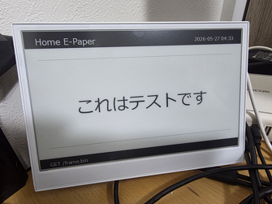

# reTerminal E1001 ホーム表示プロジェクト

Seeed **reTerminal E1001** (800×480 UC8179 電子ペーパー搭載 ESP32 ボード) を使って、  
自宅サーバーからテキストを取得し 4 階調で表示する Arduino スケッチと Python サーバーのセットです。



---

## 機能概要

| コンポーネント | 役割 |
|---|---|
| `GxEPD2_reTerminal_E1001_Gray_Image.ino` | ESP32 スケッチ。Wi-Fi 接続 → HTTP でフレーム取得 → 電子ペーパー表示 → ディープスリープ |
| `server/server.py` | テキストから 4 階調フレームを生成して配信する Python HTTP サーバー |

---

## 必要なもの

### ハードウェア
- Seeed reTerminal E1001 (ESP32-S3 + UC8179 電子ペーパー, 800×480)

### ソフトウェア
- [Arduino IDE](https://www.arduino.cc/en/software) または PlatformIO
- ESP32 Arduino コア (Espressif Systems)
- Adafruit GFX ライブラリ
- Python 3.9 以上 (サーバー側)

---

## セットアップ

### 1. Wi-Fi・サーバー設定ファイルの準備

機密情報は `secrets.h` で管理します。テンプレートをコピーして設定してください。

```bash
# Windows
copy secrets.h.example secrets.h

# Linux / macOS
cp secrets.h.example secrets.h
```

`secrets.h` を開き、実際の値に書き換えます。

```cpp
static const char* WIFI_SSID = "自宅のSSID";
static const char* WIFI_PASS = "自宅のパスワード";
static const char* SERVER_HOST = "192.168.1.100";  // サーバーの IP
static const uint16_t SERVER_PORT = 8000;
static const char* SERVER_PATH = "/frame.bin";
```

> **注意**: `secrets.h` は `.gitignore` に登録済みのため、Git にはコミットされません。

---

### 2. Arduino スケッチの書き込み

Arduino IDE でスケッチフォルダ全体を開き、reTerminal E1001 に書き込みます。

スケッチの動作フロー:

```
起動
 ↓
Wi-Fi 接続 (30 秒タイムアウト)
 ↓ 成功                   ↓ 失敗
HTTP GET /frame.bin     エラーメッセージを表示
 ↓ 96,000 バイト受信
電子ペーパーに表示 (4 階調)
 ↓
ディープスリープ (6 時間 または KEY0/KEY1/KEY2 押下で復帰)
```

#### ユーザーキー配線 (回路図参照)

| キー | GPIO | 説明 |
|------|------|------|
| KEY0 | 3 | アクティブロー, 内部プルアップ |
| KEY1 | 4 | アクティブロー, 内部プルアップ |
| KEY2 | 5 | アクティブロー, 内部プルアップ |

---

### 3. Python サーバーの起動

依存パッケージをインストールします。

```bash
python -m pip install -r server/requirements.txt
```

サーバーを起動します。

```bash
python server/server.py --host 0.0.0.0 --port 8000
```

オプション:

| オプション | 環境変数 | デフォルト | 説明 |
|---|---|---|---|
| `--host` | `HOST` | `0.0.0.0` | リッスン IP アドレス |
| `--port` | `PORT` | `8000` | ポート番号 |
| `--text` | `EPAPER_TEXT` | `Hello E-Paper` | 起動時の初期テキスト |
| `--font` | `EPAPER_FONT` | 自動検出 | フォントファイルパス |

#### Web UI

ブラウザで `http://<サーバーIP>:8000/` を開くと、テキスト入力フォームとプレビュー画像が表示されます。

#### API エンドポイント

| パス | メソッド | 説明 |
|------|---------|------|
| `/` | GET | 管理 UI (HTML) |
| `/frame.bin` | GET | 4 階調フレームバイナリ (96,000 バイト) |
| `/preview.png` | GET | PNG プレビュー画像 |
| `/text` | GET | 現在のテキスト (プレーンテキスト) |
| `/health` | GET | ヘルスチェック |
| `/set` | POST | テキスト更新 (`text=...` フォームデータ) |

---

## フレームフォーマット

デバイスが取得するバイナリ (`/frame.bin`) の仕様:

| 項目 | 値 |
|---|---|
| サイズ | 96,000 バイト |
| 解像度 | 800 × 480 ピクセル |
| ビット深度 | 2 ビット / ピクセル |
| パッキング | 4 ピクセル / バイト |
| ピクセル順 | 左→右 = ビット 7..6, 5..4, 3..2, 1..0 |

階調値の対応:

| 値 | 表示色 |
|---|---|
| `0` | 黒 |
| `1` | ダークグレー |
| `2` | ライトグレー |
| `3` | 白 |

---

## ディレクトリ構成

```
.
├── GxEPD2_reTerminal_E1001_Gray_Image.ino  # Arduino スケッチ (本体)
├── secrets.h                               # 機密設定 (gitignore 対象)
├── secrets.h.example                       # 設定テンプレート
├── .gitignore
├── LICENSE
├── README.md
└── server/
    ├── server.py                           # Python HTTP サーバー
    └── requirements.txt                    # Python 依存パッケージ
```

---

## ライセンス

このプロジェクトは [Unlicense](LICENSE) のもとで公開されています。  
パブリックドメインとして自由に利用・改変・再配布できます。
